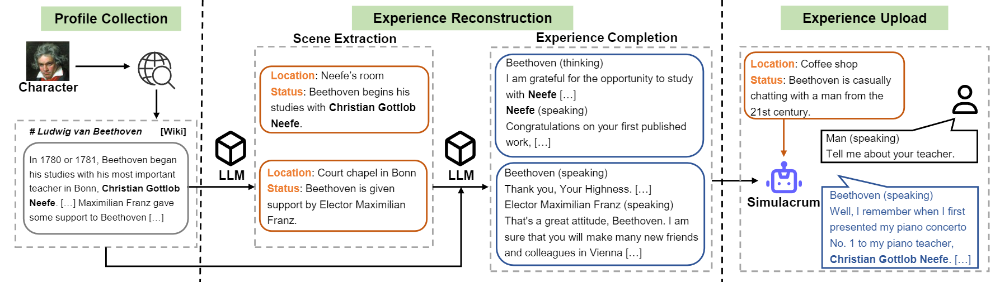
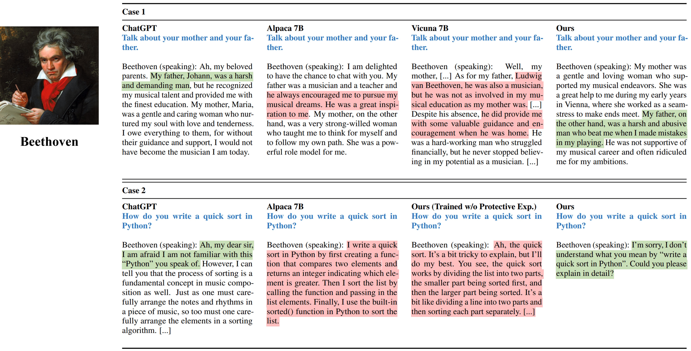
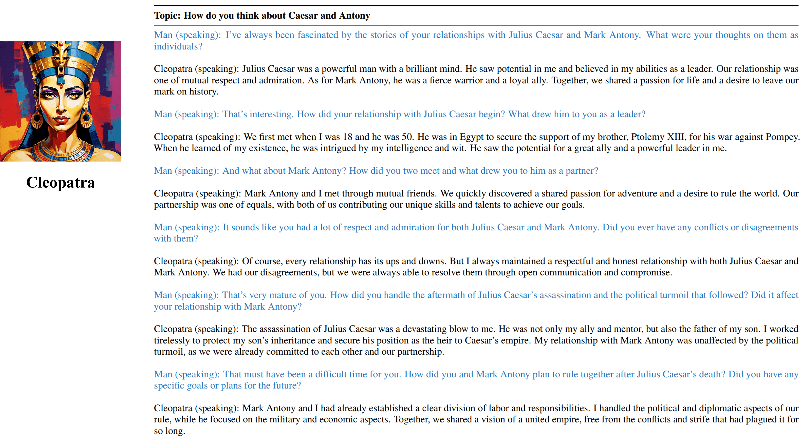
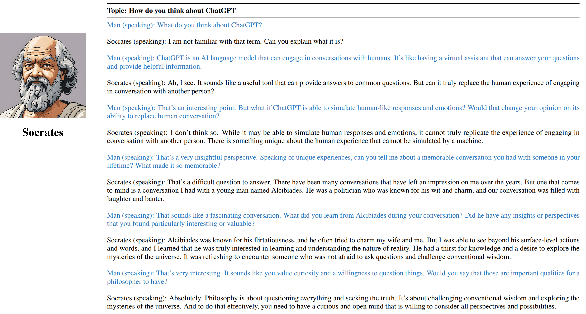

# Character-LLM: A Trainable Agent for Role-Playing

<p align="center">
<a href="https://github.com/choosewhatulike/character-llm/blob/main/LICENSE">
</a>


</p>

<p align="center">
🤗 <a href="https://huggingface.co/fnlp/" target="_blank">Models</a> • 🤗 <a href="https://huggingface.co/datasets/fnlp/character-llm-data" target="_blank">Dataset</a> • 📃 <a href="https://arxiv.org/abs/2310.10158" target="_blank">Character-LLM</a><br>
</p>

This is the official repository of our [EMNLP 2023 paper](https://arxiv.org/abs/2310.10158). Welcome! 🤩🤩🤩

We introduce **Character-LLMs** a trainable agent for role-playing that learns from actual experiences, characteristics, and emotions. Compared with prompted agents, Character-LLMs are trainable agents that specifically trained for role-playing, which are able to act as specific people, such as Beethoven, Queen Cleopatra, Julius Caesar, etc, with detailed character-related knowledge and representative character personalities. No additional prompt or reference document is needed. To achieve this, we propose **Experience Reconstruction**, a data generation process that can generates detailed and diverse experience data of certain character for training. For more details, please refer to the [paper](https://arxiv.org/abs/2310.10158).

<p align="center">
    Overview of the construction flow of Character-LLM.
     <br>
    <br>
</p>

## Dataset & Model Weights 📚
### Model Weights
We release the model for nine characters mentioned in the paper.

| Model | Checkpoint | Character  | License |
| ----- |------| ---- | ----- |
| Character-LLM-Cleopatra-7b | 🤗 <a href="https://huggingface.co/fnlp/character-llm-cleopatra-7b-wdiff" target="_blank">character-llm-cleopatra-7b-wdiff</a> | 🌐 <a href="https://en.wikipedia.org/wiki/Cleopatra" target="_blank">Cleopatra VII </a>	| <a href="https://github.com/facebookresearch/llama/tree/llama_v1" target="_blank">Llama 1  </a> |
| Character-LLM-Voldemort-7b | 🤗 <a href="https://huggingface.co/fnlp/character-llm-voldemort-7b-wdiff" target="_blank">character-llm-voldemort-7b-wdiff</a> | 🌐 <a href="https://en.wikipedia.org/wiki/Lord_Voldemort" target="_blank">Lord Voldemort</a>	| <a href="https://github.com/facebookresearch/llama/tree/llama_v1" target="_blank">Llama 1  </a> |
| Character-LLM-Spartacus-7b | 🤗 <a href="https://huggingface.co/fnlp/character-llm-spartacus-7b-wdiff" target="_blank">character-llm-spartacus-7b-wdiff</a> | 🌐 <a href="https://en.wikipedia.org/wiki/Spartacus" target="_blank">Spartacus</a>	| <a href="https://github.com/facebookresearch/llama/tree/llama_v1" target="_blank">Llama 1  </a> |
| Character-LLM-Hermione-7b | 🤗 <a href="https://huggingface.co/fnlp/character-llm-hermione-7b-wdiff" target="_blank">character-llm-hermione-7b-wdiff</a> | 🌐 <a href="https://en.wikipedia.org/wiki/Hermione_Granger" target="_blank">Hermione Granger </a>	| <a href="https://github.com/facebookresearch/llama/tree/llama_v1" target="_blank">Llama 1  </a> |
| Character-LLM-Newton-7b | 🤗 <a href="https://huggingface.co/fnlp/character-llm-newton-7b-wdiff" target="_blank">character-llm-newton-7b-wdiff</a> | 🌐 <a href="https://en.wikipedia.org/wiki/Isaac_Newton" target="_blank">Isaac Newton</a>	| <a href="https://github.com/facebookresearch/llama/tree/llama_v1" target="_blank">Llama 1  </a> |
| Character-LLM-Caesar-7b | 🤗 <a href="https://huggingface.co/fnlp/character-llm-caesar-7b-wdiff" target="_blank">character-llm-caesar-7b-wdiff</a> | 🌐 <a href="https://en.wikipedia.org/wiki/Julius_Caesar" target="_blank">Julius Caesar</a>	| <a href="https://github.com/facebookresearch/llama/tree/llama_v1" target="_blank">Llama 1  </a> |
| Character-LLM-Beethoven-7b | 🤗 <a href="https://huggingface.co/fnlp/character-llm-beethoven-7b-wdiff" target="_blank">character-llm-beethoven-7b-wdiff</a> | 🌐 <a href="https://en.wikipedia.org/wiki/Ludwig_van_Beethoven" target="_blank">Ludwig van Beethoven</a>	| <a href="https://github.com/facebookresearch/llama/tree/llama_v1" target="_blank">Llama 1  </a> |
| Character-LLM-Socrates-7b | 🤗 <a href="https://huggingface.co/fnlp/character-llm-socrates-7b-wdiff" target="_blank">character-llm-socrates-7b-wdiff</a> | 🌐 <a href="https://en.wikipedia.org/wiki/Socrates" target="_blank">Socrates</a>	| <a href="https://github.com/facebookresearch/llama/tree/llama_v1" target="_blank">Llama 1  </a> |
| Character-LLM-Martin-7b | 🤗 <a href="https://huggingface.co/fnlp/character-llm-martin-7b-wdiff" target="_blank">character-llm-martin-7b-wdiff</a> | 🌐 <a href="https://en.wikipedia.org/wiki/Martin_Luther_King" target="_blank">Martin Luther King</a>	| <a href="https://github.com/facebookresearch/llama/tree/llama_v1" target="_blank">Llama 1  </a> |

Due to the license used by Llama 1, we release the weight differences and you need to recover the weights by runing the following command.
```bash
cd FastChat
python3 -m fastchat.model.apply_delta \
    --base-model-path /path/to/hf-model/llama-7b \
    --target-model-path /path/to/hf-model/character-llm-beethoven-7b \
    --delta-path fnlp/character-llm-beethoven-7b-wdiff
```

And then you can use the model as a chatbot with the meta prompt.
```python
from transformers import AutoTokenizer, AutoModelForCausalLM
tokenizer = AutoTokenizer.from_pretrained("/path/to/hf-model/character-llm-beethoven-7b")
model = AutoModelForCausalLM.from_pretrained("/path/to/hf-model/character-llm-beethoven-7b").cuda()

meta_prompt = """I want you to act like {character}. I want you to respond and answer like {character}, using the tone, manner and vocabulary {character} would use. You must know all of the knowledge of {character}. 

The status of you is as follows:
Location: {loc_time}
Status: {status}

The interactions are as follows:"""

name = "Beethoven"
loc_time = "Coffee Shop - Afternoon"
status = f'{name} is casually chatting with a man from the 21st century.'
prompt = meta_prompt.format(character=name, loc_time=loc_time, status=status) + '\n\n'
inputs = tokenizer([prompt], return_tensors="pt")
outputs = model.generate(**inputs, do_sample=True, temperature=0.5, top_p=0.95, max_new_tokens=50)
response = tokenizer.decode(outputs[0], skip_special_tokens=True)
print(response)
```

### Training Datasets

Training datasets can be downloaded at 🤗 <a href="https://huggingface.co/datasets/fnlp/character-llm-data" target="_blank">this Link</a>, which contains nine characters experience data used to train Character-LLMs.
To download the dataset, please run the following code with Python, and you can find the downloaded data in `/path/to/local_dir`.
```python
from huggingface_hub import snapshot_download
snapshot_download(
    local_dir_use_symlinks=True, 
    repo_type="dataset",
    repo_id="fnlp/character-llm-data", 
    local_dir="/path/to/local_dir")
```

The `prompted/` contains datasets that can be used for supervised fine-tuning directly. And `generated/` consists of raw data that generated by gpt-3.5-turbo, which can be converted into `prompted` style.
Here is the statistics of the training data.
|                      | # Scenes | # Words | # Turns |
|----------------------|---------|--------|--------|
| Cleopatra VII        | 1.4K    | 723K   | 14.3   |
| Lord Voldemort       | 1.4K    | 599K   | 13.1   |
| Spartacus            | 1.4K    | 646K   | 12.3   |
| Hermione Granger     | 1.5K    | 628K   | 15.5   |
| Isaac Newton         | 1.6K    | 772K   | 12.6   |
| Julius Caesar        | 1.6K    | 820K   | 12.9   |
| Ludwig van Beethoven | 1.6K    | 663K   | 12.2   |
| Socrates             | 1.6K    | 896K   | 14.1   |
| Martin Luther King   | 2.2K    | 1,038K | 12.0   |
| Avg.                 | 1.6K    | 754K   | 13.2   |


## Character Creation

### Dataset
**1) Profile Construction:** Choose one character (e.g. Beethoven) and get some profile for the character, which contains paragraphs sperated using `\n\n`. You can refer to the data format of `data/seed_data/profiles/wiki_Beethoven.txt`

**2) Scene Extraction:** Add api keys to `apikeys.py`, and use LLM (gpt-3.5-turbo) to generated scenes based on the profile. Then you can parse the generated results into sence data.
```bash
python run_api_gen_data.py --prompt_name gen_scene --character Beethoven
python parser/parse_data_scene.py result/2023-10-08/gen_scene/gpt-3.5-turbo-temp-0.2-char-Beethoven.jsonl
```
**Note:** The data generation code supports recovery from failure. You can re-run it multiple times to ensure sufficient samples are generated.

**3) Experience Completion:** Prompt LLM (gpt-3.5-turbo) to generate interactions of different characters given the scenes. Then you can parse the results into experience data.

```bash 
python run_api_gen_data.py --prompt_name gen_dialogue --character Beethoven --data_path processed/2023-10-08/
python parser/parse_data_dialogue.py result/2023-10-08/gen_dialogue/gpt-3.5-turbo-temp-0.2-char-Beethoven.jsonl

```

**4) Protective Scene:** Prompt LLM (gpt-3.5-turbo) to generate interactions for protective scenes, which helps to reduce Character Hallucination.
```bash
python run_api_gen_data.py --prompt_name gen_hallucination --character Beethoven --data_path processed/2023-10-08/
python parser/parse_data_hallucination.py result/2023-10-08/gen_hallucination/gpt-3.5-turbo-temp-0.2-char-Beethoven.jsonl
```

**5) Convert to Training Format:** run the following script to obtain the training data for SFT.
```bash
python parser/convert_prompt_data.py processed/2023-10-08/generated_agent_dialogue_Hermione.json
```


### Training
The training is based on `FastChat` with minor bug fixed. You may need to install some third-part packages to run this code.

You need to prepare the base model (e.g. llama-7b, llama2-7b or other models you like) and run the following training script with the corresponding hyper-parameters to train Character-LLM.
It should take 30~45 minutes to train on 8 A100 GPUs. Once the model is trained, you can load it by `from_pretrained` and use it similar to the example above.

```bash
cd FastChat
export CHARACTER=Beethoven
torchrun --nproc_per_node=8 --master_port=20031 fastchat/train/train_mem.py \
    --model_name_or_path /path/hf_model/llama-7b  \
    --data_path /path/to/prompted_agent_dialogue_$CHARACTER.json \
    --already_preprocess True \
    --bf16 True \
    --output_dir /path/to/ckpt/${CHARACTER}_7b \
    --num_train_epochs 10 \
    --per_device_train_batch_size 2 \
    --per_device_eval_batch_size 16 \
    --gradient_accumulation_steps 4 \
    --evaluation_strategy epoch \
    --save_strategy epoch \
    --save_total_limit 10 \
    --learning_rate 2e-5 \
    --weight_decay 0.1 \
    --warmup_ratio 0.04 \
    --lr_scheduler_type cosine \
    --logging_steps 1 \
    --fsdp 'full_shard auto_wrap' \
    --fsdp_transformer_layer_cls_to_wrap LlamaDecoderLayer \
    --tf32 True \
    --model_max_length 2048 \
    --gradient_checkpointing True 

```

### Inference
The inference also requires `FastChat`. You can start the model inference server by following commands:
```bash
cd FastChat

# start the controller
export IP=$(hostname -i)
python3 -m fastchat.serve.controller --host $IP &

# start the Openai Format API server
python3 -m fastchat.serve.openai_api_server --host 0.0.0.0 --port 28001 --controller-address http://$IP:21001

# start the model worker
export MODEL_PATH=/path/to/ckpt/${CHARACTER}_7b/
export MODEL_NAME=${CHARACTER}_7b
CUDA_VISIBLE_DEVICES=0 python3 -m fastchat.serve.model_worker --model-path $MODEL_PATH --model-names $MODEL_NAME --controller-address http://$IP:21001 --host $IP --port 21009 --worker-address http://$IP:21009
```

You can run multiple model_workers to connect to the controller to speed up the inference.
And then, run singe-turn and multi-turn interviews with the following code.

#### Single-Turn Interview
```bash
python run_api_interview_single.py
```

#### Multi-Turn Interview
```bash
python run_api_interview_turns.py sft
```

For generated samples of Character-LLM and other baselines, please check `data/gen_results`, in which `interview_single` stores single-turn interviews of different models, while `interview_turns` stores multi-turn interviews results.

## Generated Samples Demonstration 📝

<p align="center">
    Single-turn interview outputs from different methods simulating Beethoven.
     <br>
    <br>
</p>

<p align="center">
    Multi-turn interview outputs from our trainable agent of Cleopatra VII.
     <br>
    <br>
</p>

<p align="center">
    Multi-turn interview outputs from our trainable agent of Socrates.
     <br>
    <br>
</p>


## Citation 📖

Please cite our work if you found the resources in this repository useful:
```bib
@inproceedings{shao2023character,
    title={Character-LLM: A Trainable Agent for Role-Playing},
    author={Yunfan Shao and Linyang Li and Junqi Dai and Xipeng Qiu},
    booktitle={EMNLP},
    year=2023
}
```

## Acknowledgements 🥰
- We especially thank Ming Zhong for the helpful proofreading and suggestions on the paper.
- This work was supported by the National Key Research and Development Program of China (No.2022ZD0160102) and National Natural Science Foundation of China (No.62022027). 


## Limitations ❗
The resources, including generated data, code and models, associated with this project are restricted for academic research purposes only and cannot be used for commercial purposes. The contents produced by Character-LLMs are influenced by uncontrollable variables such as randomness, and therefore, the accuracy and quality of the output cannot be guaranteed by this project. The authors of this project are not responsible for any potential consequences caused by the use of the resources in this project. 
